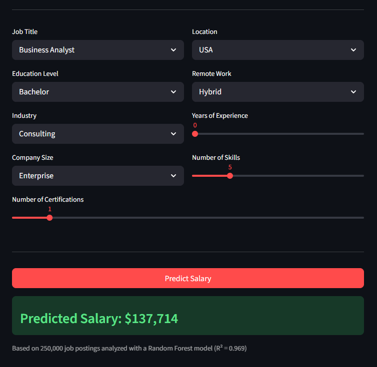
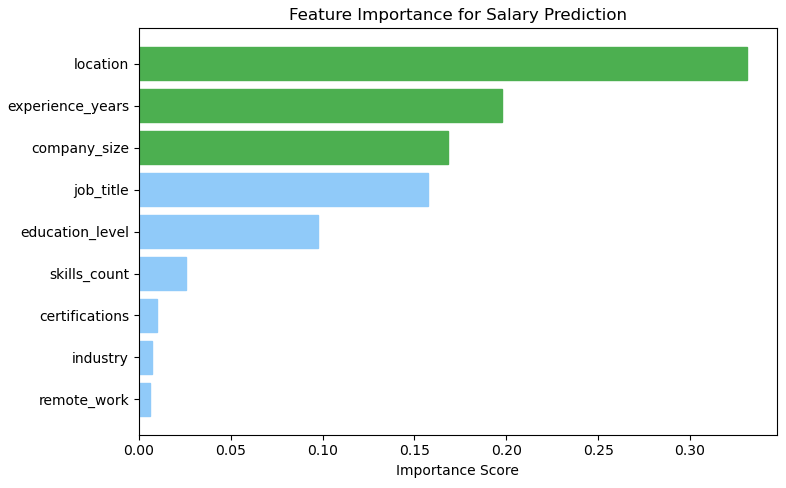
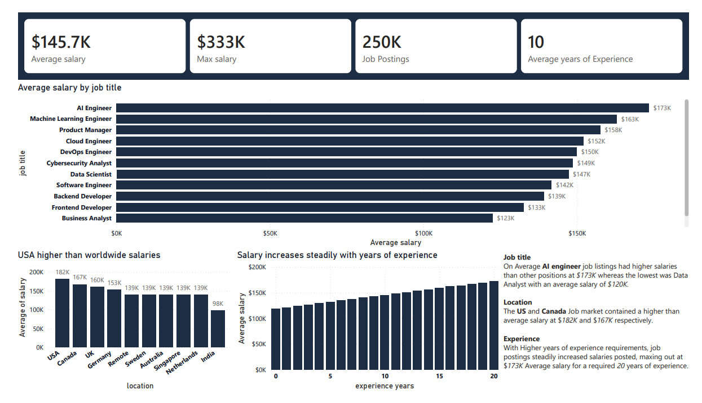
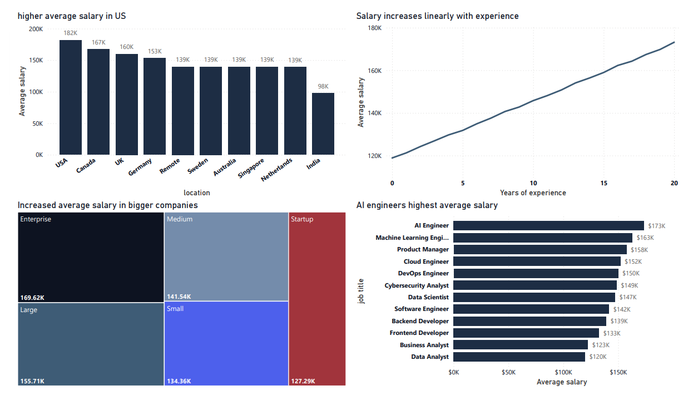
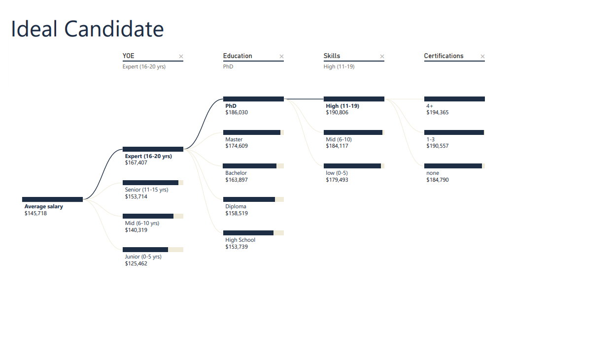

# Job Salary Data Analysis & Predictor

A end-to-end data analytics project analyzing 250,000 job postings to identify salary drivers, uncover market trends, and deploy a machine learning salary predictor as a live web application.

---

## Live App
[Job Salary Predictor](job-salary-data-analysis-sgh3guxrlgvch7gp6azncf
.streamlit.app)
---


## 🛠️ Tech Stack


## Project Structure

```
job-salary-data-analysis/
│
├── data/
│   └── cleaned_jobs_salary.csv          # Cleaned dataset (250,000 rows)
│
├── SQL QUERIES/                         # MySQL analysis queries
│   ├── job_table_creation.sql
│   ├── summary statistics.sql
│   ├── salary ranges.sql
│   └── ...
│
├── python cleaning and jupyter notebook analysis/
│   ├── data_clean.py                    # Data cleaning script
│   └── feature_exploration.ipynb        # EDA and feature importance
│
├── Predictive Analytics/
│   └── predictive model.ipynb           # Model training and evaluation
│
├── salary predictor/
│   ├── app.py                           # Streamlit web app
│   ├── salary_model.pkl                 # Trained Random Forest model
│   ├── encoders.pkl                     # Saved label encoders
│   └── cleaned_jobs_salary.csv          # Data for dropdown population
│
├── job dashboard.pbix                   # Power BI dashboard file
├── requirements.txt
└── README.md
```

---

## Dataset

The dataset contains 250,000 job postings with the following features:

| Column | Description |
|---|---|
| `job_title` | Title of the job posting |
| `experience_years` | Years of experience required |
| `education_level` | Minimum education requirement |
| `skills_count` | Number of skills listed |
| `industry` | Industry of the company |
| `company_size` | Size of the company |
| `location` | Country of the job |
| `remote_work` | Remote, Hybrid, or On-site |
| `certifications` | Number of certifications required |
| `salary` | Listed salary in USD |

---

## SQL Analysis

Data was loaded into a MySQL database using `LOAD DATA INFILE` and analyzed using a series of queries covering:

- Summary statistics (min, max, avg, stddev salary)
- Average salary by job title, industry, education level, and location
- Impact of experience, skills, and certifications on salary
- Remote vs hybrid vs on-site salary comparison
- Salary distribution across defined bands (Under 50K, 50K–100K, etc.)

---

## Python Exploratory Analysis

### Data Cleaning
Raw data was cleaned using `data_clean.py`:
- Removed duplicates and null values
- Standardized categorical column formatting
- Exported cleaned dataset to CSV

### Feature Importance
Using a Random Forest model in `feature_exploration.ipynb`, features were ranked by their impact on salary:

```python
from sklearn.ensemble import RandomForestRegressor
from sklearn.preprocessing import LabelEncoder

model = RandomForestRegressor(n_estimators=100, random_state=42)
model.fit(X, y)

importances = pd.Series(model.feature_importances_, index=X.columns)
importances.sort_values(ascending=False)
```

Key findings from feature importance analysis:
- **Job title** and **location** were the strongest salary drivers
- **Experience years** showed a consistent positive correlation with salary
- **Industry** had minimal impact — all industries averaged close to $145K
- **Remote work** added only ~$5,347 on average over on-site roles

---

## 📈 Power BI Dashboard

The dashboard is split across three pages:


### Overview
High-level summary of the dataset with four KPI cards:
- Average Salary: **$145.72K**
- Max Salary: **$333K**
- Total Job Postings: **250K**
- Average Years of Experience: **10.01**

Supporting visuals cover industry salary comparison, education level impact, and remote work salary breakdown. A text insights panel summarizes key findings directly on the page.


### Salary Drivers
Dedicated page analyzing the four strongest salary factors:
- Average salary by **location** — USA and Canada lead
- Average salary by **experience years** — steady upward trend shown as a line chart
- Average salary by **company size** — Enterprise pays ~30% more than Startups
- Average salary by **job title** — AI Engineer and ML Engineer top the rankings


### Candidate Profile
A Power BI **Decomposition Tree** breaking down the highest salary combinations across education level, experience, skills count, and certifications. Reveals that the highest earning profile tends to be a PhD holder with 20 years of experience and 4+ certifications averaging **$213,583**.

---

## Predictive Model

### Approach
A **Random Forest Regressor** was chosen for its ability to handle mixed data types (numerical and categorical), built-in feature importance, and strong out-of-the-box performance on tabular data.

### Preprocessing
```python
cat_cols = ['job_title', 'education_level', 'industry',
            'company_size', 'location', 'remote_work']

for col in cat_cols:
    df[col] = LabelEncoder().fit_transform(df[col])
```

### Model Comparison

| Model | MAE | R² |
|---|---|---|
| Linear Regression | $21,741 | 0.4560 |
| Gradient Boosting | $12,130 | 0.8374 |
| **Random Forest** | **$5,232** | **0.9685** |

### Hyperparameter Tuning
`RandomizedSearchCV` was used over a parameter grid to find optimal settings:

```python
Best params: {
    'n_estimators': 200,
    'max_depth': 20,
    'min_samples_split': 2
}
```

### Final Model Performance

| Metric | Score |
|---|---|
| MAE | $5,171 |
| R² (Test) | 0.9692 |
| R² (Train) | 0.9946 |

---

## Streamlit Web App

The trained model is deployed as an interactive web app built with Streamlit.

### Features
- Dropdowns for all categorical inputs populated directly from the dataset
- Sliders for experience, skills, and certifications
- Instant salary prediction on button click
- Hosted publicly on Streamlit Community Cloud

### Running Locally

```bash
# Install dependencies
pip install -r requirements.txt

# Run the app
cd "salary predictor"
streamlit run app.py
```

### How It Works
1. User selects job profile inputs via dropdowns and sliders
2. Categorical inputs are encoded using the saved `LabelEncoder` objects
3. Input is passed to the loaded Random Forest model
4. Predicted salary is displayed instantly

```python
prediction = model.predict(input_data)[0]
st.success(f"### Predicted Salary: ${prediction:,.0f}")
```

---

## Tech Stack

| Tool | Purpose |
|---|---|
| MySQL + MySQL Workbench | Data storage and SQL analysis |
| Python / Pandas | Data cleaning and EDA |
| Scikit-learn | Feature importance and model training |
| Joblib | Model serialization |
| Power BI | Dashboard and data visualization |
| Streamlit | Web app deployment |
| GitHub | Version control and hosting source |

---

## Requirements

```
streamlit
pandas
scikit-learn==1.7.2
joblib
numpy
```
